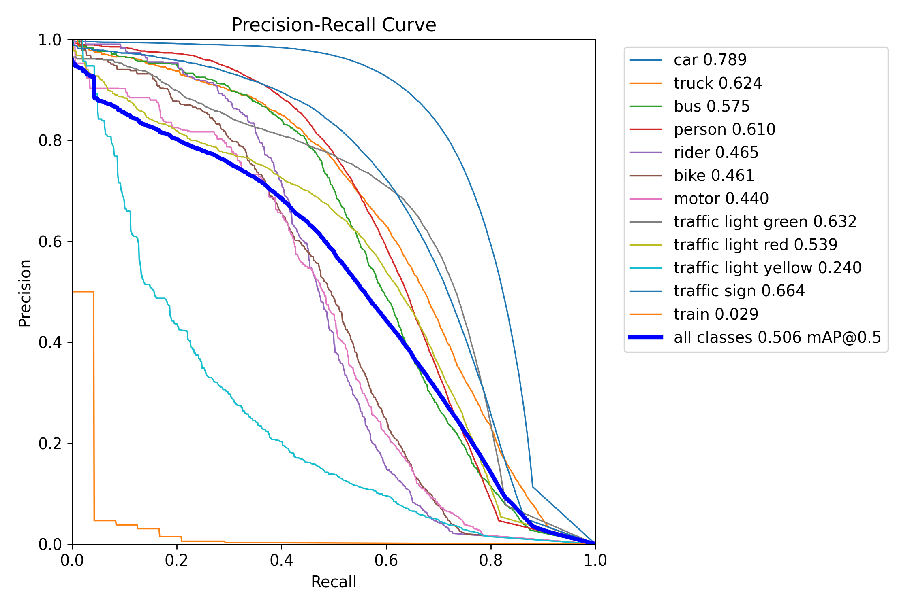
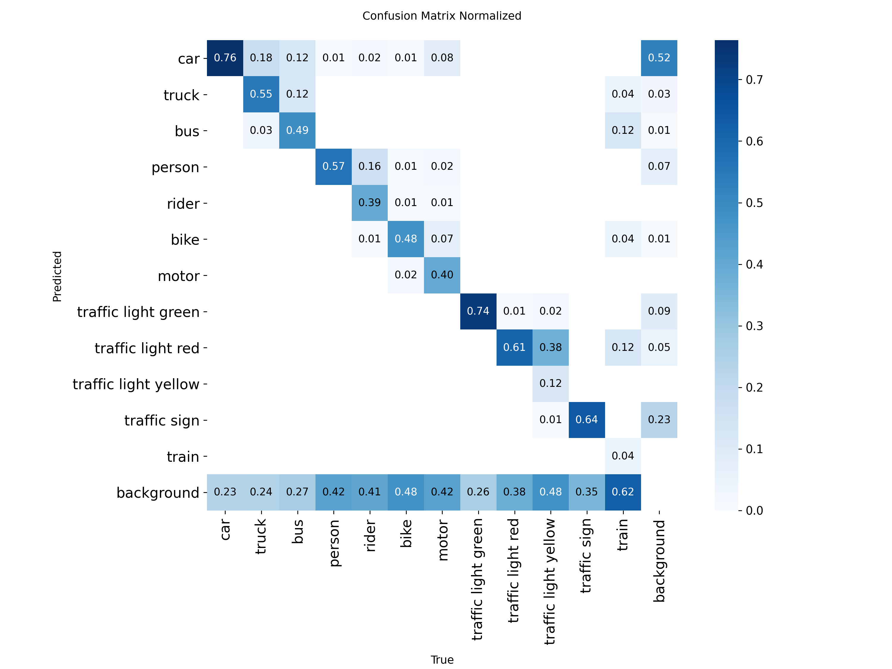
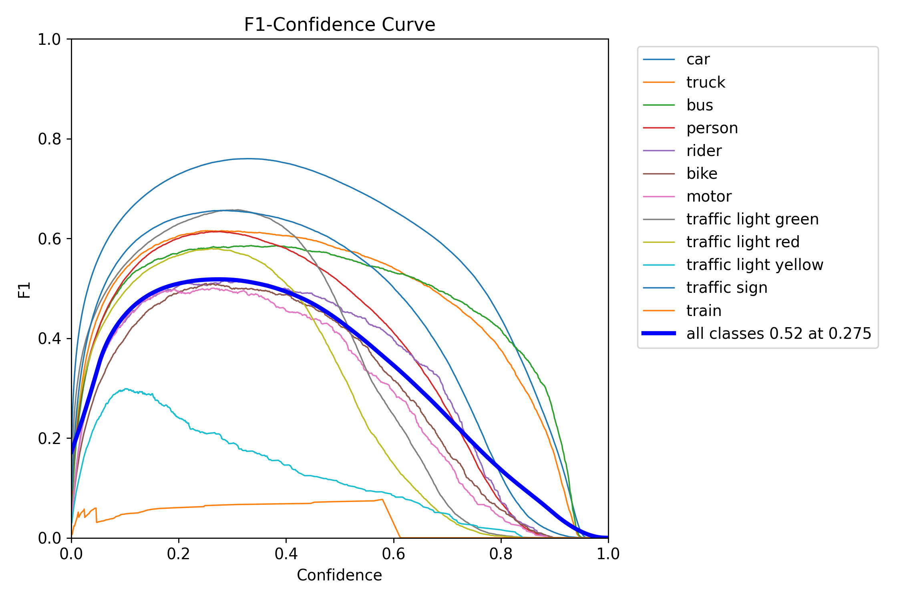

# Road Object Detection with YOLO11

## Demo


*Real-time object detection on road scenes using trained YOLO11s model*

---

## Table of Contents

- [Overview](#overview)
- [Dataset](#dataset)
- [Model Architecture](#model-architecture)
- [Training Configuration](#training-configuration)
- [Results](#results)
- [Installation](#installation)
- [Usage](#usage)
- [Project Structure](#project-structure)
- [Hyperparameters](#hyperparameters)
- [Evaluation Metrics](#evaluation-metrics)
- [Class Definitions](#class-definitions)

---

## Overview

This project implements **YOLO11s** (small variant) object detection on the **BDD100K** dataset for road scene understanding. The model is trained to detect 12 classes of objects including vehicles, pedestrians, traffic lights, and traffic signs.

### Key Features

- Real-time object detection on road scenes
- Trained on 60,000 BDD100K images
- Best model achieved at **Epoch 77**
- Support for video inference and webcam input
- Comprehensive evaluation metrics and visualizations

---

## Dataset

### BDD100K (Berkeley DeepDrive 100K Dataset)

The BDD100K dataset is a large-scale diverse driving video dataset collected by UC Berkeley. It contains 100,000 video clips with diverse weather conditions, times of day, and scene types.

**Dataset Link:** [https://www.bdd100k.com/](https://www.bdd100k.com/)
**Paper:** [Scalable Driving Dataset Learning](https://arxiv.org/abs/1805.04687)

### Dataset Statistics

| Split | Images | Labels |
|-------|--------|--------|
| **Training** | 60,000 | 60,000 |
| **Validation** | 8,571 | 8,571 |
| **Test** | 17,143 | 17,143 |
| **Total** | **85,714** | **85,714** |

### Data Preprocessing

- **Image Resolution:** Original BDD100K images (1280×720) resized to 640×640
- **Normalization:** YOLO format (normalized coordinates [0,1])
- **Train/Val/Test Split:** Used official BDD100K splits
- **Label Format:** YOLO TXT format (class_id, x_center, y_center, width, height)

---

## Class Definitions

| Index | Class Name | Description |
|-------|------------|-------------|
| 0 | `car` | Passenger cars |
| 1 | `truck` | Trucks and heavy vehicles |
| 2 | `bus` | Public transport buses |
| 3 | `person` | Pedestrians |
| 4 | `rider` | People on vehicles (bike, motorcycle) |
| 5 | `bike` | Bicycles |
| 6 | `motor` | Motorcycles |
| 7 | `traffic light green` | Green traffic lights |
| 8 | `traffic light red` | Red traffic lights |
| 9 | `traffic light yellow` | Yellow traffic lights |
| 10 | `traffic sign` | Traffic signs |
| 11 | `train` | Trains |

**Total Classes:** 12

---

## Model Architecture

### YOLO11s (You Only Look Once v11 - Small)

YOLO11s is the small variant of the YOLO11 family, designed for real-time object detection with a balance between accuracy and speed.

**Model Paper:** [Ultralytics YOLO11](https://github.com/ultralytics/ultralytics)

### Architecture Specifications

| Component | Details |
|-----------|---------|
| **Backbone** | CSPDarknet with C3k2 modules |
| **Neck** | PANet with SPPF and C2PSA attention |
| **Head** | Decoupled head with DFL (Distribution Focal Loss) |
| **Parameters** | 9.4M |
| **FLOPs** | 21.6 GFLOPs @ 640×640 |
| **Model Size** | ~36 MB (FP32) |
| **Pre-training** | COCO 2017 dataset (80 classes) |
| **Transfer Learning** | Classification head adapted from 80 → 12 classes |

### Model Summary

```
YOLO11s summary: 182 layers, 9,432,436 parameters, 9,432,420 gradients

                   from  n    params  module                  arguments
  0                  -1  1       928  ultralytics.nn.modules.conv.Conv    [3, 32, 3, 2]
  1                  -1  1    18560  ultralytics.nn.modules.conv.Conv    [32, 64, 3, 2]
  2                  -1  1    26080  ultralytics.nn.modules.block.C3k2   [64, 128, 1, False, 0.25]
  ... (truncated for brevity)
 23        [16, 19, 22]  1    824052  ultralytics.nn.modules.head.Detect [12, 16]
```

---

## Training Configuration

### Core Training Parameters

| Parameter | Value | Description |
|-----------|-------|-------------|
| **Model** | YOLO11s | Small variant |
| **Image Size** | 640 × 640 | Square input (standard YOLO size) |
| **Batch Size** | 18 | Images per GPU forward pass |
| **Nominal Batch (nbs)** | 36 | Target effective batch size |
| **Accumulation Steps** | 2 | Gradient accumulation steps (36/18) |
| **Effective Batch** | 36 | Actual batch after accumulation |
| **Epochs** | 87 (ran) / 100 (configured) | Training epochs |
| **Best Epoch** | **77** | Epoch with highest validation mAP |
| **Early Stop Patience** | 11 | Epochs without improvement before stopping |

### Learning Rate Schedule

| Parameter | Value | Description |
|-----------|-------|-------------|
| **Initial LR (lr0)** | 0.001 | Starting learning rate |
| **Final LR Factor (lrf)** | 0.01 | LR = lr0 × lrf at end |
| **Final LR** | 0.00001 | Learning rate at final epoch |
| **Scheduler** | Cosine Annealing | Smooth LR decay over training |
| **Warmup Epochs** | 3 | Linear warmup at start |
| **Warmup Momentum** | 0.8 | Initial momentum during warmup |
| **Momentum** | 0.937 | Adam beta1 / SGD momentum |

### Optimizer Configuration

| Parameter | Value | Description |
|-----------|-------|-------------|
| **Optimizer** | AdamW | Adam with decoupled weight decay |
| **Weight Decay** | 0.0005 | L2 regularization |
| **Weight Decay on** | Weights only | Biases excluded from decay |

### Loss Function

| Loss Component | Weight | Description |
|----------------|--------|-------------|
| **Box Loss** | 7.5 | Bounding box regression loss |
| **Classification Loss** | 0.5 | Object classification loss |
| **DFL Loss** | 1.5 | Distribution Focal Loss |

### Data Augmentation

| Parameter | Value | Description |
|-----------|-------|-------------|
| **Hue (HSV-H)** | ±0.015 | Color hue augmentation |
| **Saturation (HSV-S)** | ±0.7 | Color saturation augmentation |
| **Brightness (HSV-V)** | ±0.4 | Value/brightness augmentation |
| **Rotation (degrees)** | 0.0° | Disabled (upright road objects) |
| **Translation** | ±0.1 | Horizontal/vertical shift |
| **Scale** | 0.5 | Zoom in/out gain |
| **Horizontal Flip** | 50% | fliplr=0.5 |
| **Mosaic** | 100% | 4-image mosaic (disabled in last 10 epochs) |
| **Mixup** | 0% | Image mixing (could enable for more diversity) |

### Hardware & Training Settings

| Parameter | Value | Description |
|-----------|-------|-------------|
| **Device** | GPU 0 (NVIDIA RTX 4060) | 8GB VRAM |
| **Workers** | 2 | DataLoader workers |
| **Mixed Precision (AMP)** | Enabled | FP16 activations, FP32 weights |
| **Pin Memory** | Auto-enabled | GPU memory optimization |
| **Deterministic** | True | Reproducible results |

---

## Results

### Best Model Performance (Epoch 77)

#### Validation Metrics

| Metric | Value | Description |
|--------|-------|-------------|
| **mAP@0.5** | **0.503** | Mean Average Precision at IoU≥0.5 |
| **mAP@0.5:0.95** | **0.269** | Mean AP across IoU thresholds 0.5-0.95 |
| **Precision** | **0.670** | TP / (TP + FP) |
| **Recall** | **0.421** | TP / (TP + FN) |

#### Test Set Metrics

| Metric | Value |
|--------|-------|
| **mAP@0.5** | ~0.50 |
| **mAP@0.5:0.95** | ~0.27 |
| **Precision** | ~0.69 |
| **Recall** | ~0.46 |

### Per-Class Results (Validation)

| Class | mAP@0.5 | mAP@0.5:0.95 | Precision | Recall |
|-------|---------|--------------|-----------|--------|
| **car** | 0.710 | 0.427 | 0.623 | 0.700 |
| **truck** | 0.462 | 0.319 | 0.530 | 0.451 |
| **bus** | 0.406 | 0.298 | 0.541 | 0.360 |
| **person** | 0.465 | 0.217 | 0.677 | 0.384 |
| **rider** | 0.239 | 0.099 | 0.428 | 0.257 |
| **bike** | 0.231 | 0.103 | 0.445 | 0.220 |
| **motor** | 0.134 | 0.059 | 0.301 | 0.168 |
| **traffic light green** | 0.540 | 0.169 | 0.437 | 0.651 |
| **traffic light red** | 0.392 | 0.125 | 0.459 | 0.469 |
| **traffic light yellow** | 0.102 | 0.041 | 0.363 | 0.060 |
| **traffic sign** | 0.524 | 0.259 | 0.551 | 0.527 |
| **train** | N/A | N/A | N/A | N/A (few/no samples) |

### Training Curves



*Precision-Recall curve showing the trade-off between precision and recall at different confidence thresholds.*



*Normalized confusion matrix showing prediction accuracy across all 12 classes.*



*F1 score curve across different confidence thresholds.*

---

## Installation

### Requirements

- Python 3.8+
- CUDA 11.8+ (for GPU training)
- NVIDIA GPU (RTX 4060 8GB or equivalent recommended)

### Setup

```bash
# Clone repository
git clone https://github.com/mamounyosef/road-object-detection.git
cd road-object-detection

# Install dependencies
pip install ultralytics torch torchvision

# Or install from requirements.txt (if available)
pip install -r requirements.txt
```

### Download Dataset

1. Visit [BDD100K Dataset](https://www.bdd100k.com/)
2. Download the dataset
3. Extract to `dataset/` directory
4. Ensure structure matches:
   ```
   dataset/
   ├── images/
   │   ├── train/
   │   ├── val/
   │   └── test/
   └── labels/
       ├── train/
       ├── val/
       └── test/
   ```

---

## Usage

### Training

#### Using Jupyter Notebook (Recommended)

Open `train_yolo11.ipynb` and run cells sequentially:

```bash
jupyter notebook train_yolo11.ipynb
```

The notebook contains 8 steps:
1. **Environment Setup** - GPU verification
2. **Data Loading** - Dataset verification and analysis
3. **Model Selection** - Load pretrained YOLO11s
4. **Training Configuration** - Set hyperparameters
5. **Test Run** - 2-epoch test to verify setup
6. **Full Training** - 100 epochs with early stopping
7. **Evaluation** - Test set metrics and visualizations
8. **Video Inference** - Run predictions on video files

#### Command Line Training

```python
from ultralytics import YOLO

# Load model
model = YOLO('yolo11s.pt')

# Train
results = model.train(
    data='data.yaml',
    epochs=100,
    batch=18,
    nbs=36,              # Gradient accumulation
    imgsz=640,
    device=0,
    workers=2,
    lr0=0.001,
    lrf=0.01,
    optimizer='AdamW',
    cos_lr=True,
    patience=11,
    amp=True,
)
```

### Inference

#### Image Prediction

```python
from ultralytics import YOLO

# Load trained model
model = YOLO('runs/detect/yolo11s_bdd100k_xxx/weights/best.pt')

# Predict on image
results = model.predict('path/to/image.jpg', conf=0.25)

# Visualize
for r in results:
    r.show()
```

#### Video Inference

```python
# Process video file
results = model.predict(
    source='path/to/video.mp4',
    conf=0.25,
    save=True,
    show=False,
)

# Webcam (live detection)
results = model.predict(
    source=0,  # 0 = default webcam
    conf=0.25,
    show=True,
)
```

### Test Demo Script

A simple demo script is provided at `test_demo.py`:

```python
python test_demo.py
```

---

## Project Structure

```
road-object-detection/
├── data.yaml                          # Dataset configuration
├── train_yolo11.ipynb                 # Training notebook (8 steps)
├── test_demo.py                        # Simple inference demo
├── yolo11s.pt                          # Pretrained COCO weights
├── yolo26n.pt                          # Nano variant (reference)
│
├── dataset/                            # BDD100K dataset
│   ├── images/
│   │   ├── train/          (60,000 images)
│   │   ├── val/            (8,571 images)
│   │   └── test/           (17,143 images)
│   └── labels/
│       ├── train/
│       ├── val/
│       └── test/
│
├── runs/detect/                        # Training runs & outputs
│   ├── yolo11s_bdd100k_xxx/          # Main training run
│   │   ├── weights/
│   │   │   ├── best.pt              # Best model (epoch 77)
│   │   │   └── last.pt              # Last checkpoint
│   │   ├── results.csv              # Training metrics per epoch
│   │   ├── confusion_matrix.png
│   │   ├── F1_curve.png
│   │   ├── PR_curve.png
│   │   └── ... (other plots)
│   │
│   ├── test_evaluation/              # Test set evaluation
│   │   ├── confusion_matrix.png
│   │   ├── confusion_matrix_normalized.png
│   │   ├── BoxPR_curve.png          # Precision-Recall curve
│   │   ├── BoxF1_curve.png
│   │   └── val_batch*_pred.jpg
│   │
│   ├── test_predictions/             # Sample test predictions
│   │   └── *.jpg                     (5 sample images)
│   │
│   └── video_predictions/            # Video inference outputs
│       └── watch_v_mqeUnHLOz4w.avi  # Demo video
│
└── training_results/                  # Additional results
    ├── best_model.pt                 # Copy of best model
    ├── results.csv
    └── train_batch*.jpg
```

---

## Hyperparameters

### Complete Training Configuration

```yaml
# Model Configuration
model: yolo11s.pt
pretrained: COCO
nc: 12  # Number of classes

# Training Parameters
epochs: 100
batch_size: 18
nbs: 36  # Nominal batch size (gradient accumulation)
imgsz: 640
device: 0
workers: 2

# Learning Rate
lr0: 0.001          # Initial learning rate
lrf: 0.01           # Final LR factor
momentum: 0.937
weight_decay: 0.0005
warmup_epochs: 3
cos_lr: true        # Cosine annealing scheduler

# Early Stopping
patience: 11
save_period: 5

# Augmentation
hsv_h: 0.015       # Hue ±1.5%
hsv_s: 0.7         # Saturation ±70%
hsv_v: 0.4         # Brightness ±40%
degrees: 0.0       # No rotation
translate: 0.1     # Translation ±10%
scale: 0.5         # Scale gain
fliplr: 0.5        # 50% horizontal flip
mosaic: 1.0        # 100% mosaic (off in last 10 epochs)
mixup: 0.0         # No mixup

# Optimization
optimizer: AdamW
amp: true          # Automatic Mixed Precision

# Validation
val: true
plots: true
save_json: true
```

---

## Evaluation Metrics

### Metrics Explained

| Metric | Formula | Description |
|--------|---------|-------------|
| **Precision** | TP / (TP + FP) | Accuracy of positive predictions |
| **Recall** | TP / (TP + FN) | Ability to find all positives |
| **mAP@0.5** | Mean AP at IoU≥0.5 | Standard detection metric |
| **mAP@0.5:0.95** | Mean AP at IoU 0.5, 0.6, ..., 0.95 | COCO metric |
| **F1 Score** | 2×(Precision×Recall)/(Precision+Recall) | Harmonic mean |

### IoU (Intersection over Union)

IoU measures overlap between predicted and ground truth boxes:
- IoU ≥ 0.5: Correct detection (for mAP@0.5)
- IoU ≥ 0.75: High accuracy detection
- IoU < 0.5: Miss or false positive

---

## Hardware Requirements (Used in Training)

| Component | Specification |
|-----------|---------------|
| **GPU** | NVIDIA RTX 4060 (8GB VRAM) |
| **RAM** | 16 GB |

### Performance Metrics

| Metric | Value |
|--------|-------|
| Training time per epoch | ~15-16 minutes |
| Total training time | ~25-35 hours (87 epochs) |
| Inference speed | ~1.8 ms/image @ 640×640 |
| VRAM usage (training) | ~5-6 GB |
| VRAM usage (inference) | ~2-3 GB |

---

## Citation

### BDD100K Dataset

```bibtex
@inproceedings{bdd100k,
  title={BDD100K: A Diverse Driving Video Database with Scalable Annotation Tooling},
  author={Yu, Fisher and Chen, Haoran and Wang, Xin and Xie, Yuhui and Darrell, Trevor and Yuille, Alan},
  booktitle={ECCV},
  year={2020}
}
```

### YOLO11

```bibtex
@software{yolo11_ultralytics,
  title={YOLO11 by Ultralytics},
  author={Ultralytics},
  year={2024},
  url={https://github.com/ultralytics/ultralytics}
}
```

---

## License

This project uses the BDD100K dataset. Please refer to the [BDD100K license](https://www.bdd100k.com/) for dataset usage terms.

---

## Acknowledgments

- **Ultralytics** for YOLO11 framework
- **UC Berkeley** for the BDD100K dataset
- **PyTorch** team for the deep learning framework

---

## Contact

For questions or issues, please open an issue on GitHub or contact [Mamoun Yosef](https://github.com/mamounyosef).

---
